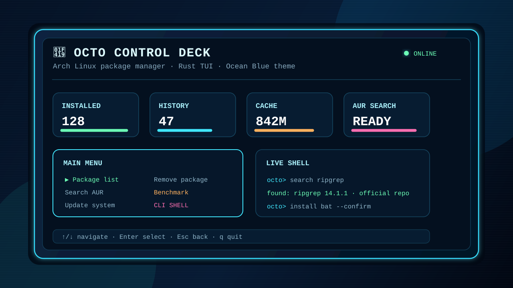

# 🐙 OCTO

## Осьминожий пакетный менеджер для Arch Linux



OCTO — экспериментальный пакетный менеджер и терминальный интерфейс для Arch
Linux. Проект объединяет C++ backend с полноэкранным TUI на Rust.
Интерфейс вдохновлён системными терминалами, CRT-мониторами и панелями управления
из референсов: тёмный фон, cyan-рамки, цветовые статусы и клавиатурная навигация.

> Проект находится в активной разработке. Перед использованием команд, которые
> изменяют систему, проверьте их поведение в исходниках и запускайте их осознанно.

## Содержание

- [Возможности](#возможности)
- [Архитектура](#архитектура)
- [Требования](#требования)
- [Установка и первый запуск](#установка-и-первый-запуск)
- [Rust TUI](#rust-tui)
- [CLI SHELL](#cli-shell)
- [CLI-команды](#cli-команды)
- [Конфигурация](#конфигурация)
- [Безопасность](#безопасность)
- [Разработка](#разработка)
- [Проверка](#проверка)
- [Устранение проблем](#устранение-проблем)
- [Планы](#планы)
- [Лицензия](#лицензия)

## Возможности

### Rust TUI

- полноэкранный терминальный интерфейс на Rust;
- тема OCTO Ocean Blue: navy-фон, cyan-контуры, зелёные, оранжевые и розовые статусы;
- современный dashboard с карточками состояния, приветствием и контекстной панелью;
- понятные пользовательские подсказки для каждого выбранного действия;
- единая SQLite-база `~/.octo/db/octo.sqlite3` для пакетов, истории и статистики;
- асинхронный поиск AUR в отдельном потоке без заморозки TUI;
- модальные окна подтверждения для потенциально опасных действий;
- progress bars для статистики, кэша и выполняемых действий;
- главное меню и экраны:
  - список пакетов;
  - поиск в AUR;
  - обновление системы;
  - удаление пакета;
  - бенчмарк;
  - статистика;
  - очистка кэша;
  - встроенный CLI SHELL;
- управление с клавиатуры без мыши;
- ограниченная навигация без ухода за пределы меню;
- контекстная нижняя панель: обычные подсказки в меню и shell-подсказки в CLI SHELL;
- история вывода и команд внутри CLI SHELL.

### C++ backend

Backend написан на C++17 и собирается в исполняемый файл `target/octo-backend`.
Папка `lib/` и старые Bash-модули удалены. Bash используется только в тонком
launcher-файле `octo`, который выбирает Rust TUI или запускает C++ backend.

### Пакетные функции

- установка из официальных репозиториев;
- установка из AUR;
- удаление пакетов;
- поиск по репозиториям и AUR;
- обновление системы;
- информация о пакете;
- список установленных пакетов;
- кэш и очистка;
- история операций и JSON-база;
- бэкапы перед изменениями;
- диагностика зависимостей и окружения;
- проверка PKGBUILD и PGP;
- мониторинг и бенчмарк.

Набор фактических команд зависит от доступных модулей и утилит в системе.

## Архитектура

```text
octo/                         корень проекта
├── Cargo.toml                Rust-проект TUI
├── src/
│   └── main.rs                Rust-приложение ratatui/crossterm
├── octo                      launcher для C++ backend и Rust TUI
├── backend/
│   └── octo_backend.cpp       исходный код C++ backend
├── etc/config.json            конфигурация проекта
└── README.md
```

### Как соединены Rust и C++

Rust TUI отвечает за экран, ввод и маршрутизацию команд. Когда пользователь
вводит поддержанную команду в CLI SHELL, Rust запускает C++ backend отдельными
аргументами:

```text
Rust TUI → whitelist-команд → ./octo → target/octo-backend <command> <args>
```

Для переопределения пути к backend используется переменная `OCTO_BACKEND_BIN`.
Если она не задана, launcher выбирает локальный `target/octo-backend`, а после
установки — `/usr/lib/octo/octo-backend`.

## Требования

### Для Rust TUI

- Linux;
- Rust stable с Cargo;
- терминал с поддержкой ANSI-цветов и alternate screen;
- рекомендуемая ширина терминала: от 100 колонок;
- рекомендуемая высота: от 30 строк.

Проверка Rust:

```bash
rustc --version
cargo --version
```

### Для C++ backend

Основные зависимости:

- `g++` с поддержкой C++17;
- SQLite3: библиотека и заголовок `sqlite3.h`;
- `curl`;
- `git`;
- `gpg`;
- `pacman`;
- `makepkg`;
- `sudo` для операций, требующих прав администратора;
- `ping` используется дополнительными сетевыми проверками.

Не все команды требуют все зависимости. Проверить окружение можно так:

```bash
./octo diagnostic
```

## Установка и первый запуск

### Установка как AUR-пакета

В репозитории подготовлены `PKGBUILD` и `.SRCINFO` для VCS-пакета `octo-git`.
Пакет можно собрать и установить через `makepkg`:

```bash
git clone https://github.com/ZolVo-o/octo.git
cd octo
makepkg -si
```

Для обновления VCS-пакета повторите команду в каталоге сборки:

```bash
git pull
makepkg -si
```

После установки команды доступны глобально:

```bash
octo help
```

Команда `octo tui` временно отключена. Сейчас проект развивает только CLI и
C++ backend пакетного менеджера; код TUI сохранён для последующего возвращения.

Для публикации в AUR файл `PKGBUILD` нужно положить в отдельный AUR-клон
`octo-git`, сгенерировать `.SRCINFO` командой `makepkg --printsrcinfo > .SRCINFO`
и отправить оба файла в AUR Git-репозиторий.

Склонируйте или скопируйте проект и перейдите в его каталог:

```bash
cd /path/to/octo
```

Сделайте launcher исполняемым:

```bash
chmod +x ./octo
```

Или используйте установщик, который создаёт ссылку в `~/.local/bin` и собирает
только C++ backend:

```bash
chmod +x ./install.sh
./install.sh
```

## Rust TUI (временно отключён)

Исходники TUI сохраняются в репозитории, но launcher и пакетная сборка временно
не запускают и не устанавливают TUI. Текущий рабочий интерфейс — CLI backend.

### Главное меню

Главное меню оформлено как dashboard. Сверху отображаются карточки состояния:

- пакеты;
- обновления;
- задержка AUR;
- состояние backend.

Ниже расположен блок быстрого старта, список действий и контекстная панель
выбранного пункта. В главном меню доступны экраны:

| Клавиша | Экран |
| --- | --- |
| `1` | Установка пакета / поиск для установки |
| `2` | Удаление пакета |
| `3` | Обновление системы |
| `4` | Список пакетов |
| `5` | Поиск в AUR |
| `6` | Бенчмарк |
| `7` | Статистика |
| `8` | Очистка |
| `9` | CLI SHELL |

### Навигация

| Клавиша | Действие |
| --- | --- |
| `↑` / `↓` | навигация |
| `j` / `k` | навигация в стиле Vim |
| `Enter` | выбрать или выполнить |
| `Esc` | вернуться в главное меню |
| `Ctrl+C` | завершить приложение |
| `q` | выйти из меню |

Размер TUI адаптируется к текущему терминалу, но слишком маленькое окно может
ухудшить читаемость таблиц.

## CLI SHELL

Откройте пункт `9` в Rust TUI. Ввод отображается в формате:

```text
octo@arch :~$
```

### Поддержанные команды

```text
install <package>
install <package> --aur
i <package>

remove <package>
uninstall <package>
r <package>

search <query>
search --aur <query>
find <query>
info <package>
ink <package>
deps <aur-package>
зависимости <aur-пакет>
size <package>
размер <package>
popularity <package>
популярность <package>

update
upgrade
list
ls
stats
cache-stats
benchmark
bench
diagnostic
diag
monitor
backup
restore <backup>
security <file>
catch <package>
release <package>
tentacle <query>
sandbox <package>
army
profile <operation> <package>
predict <package>
logs
market
matrix
pulse
clean cache
clean backups
clean history
clean all
help
clear
exit
quit
```

Примеры:

```text
install neofetch
install google-chrome --aur
search --aur firefox
remove neofetch
clean cache
```

В CLI SHELL поддерживаются:

- история введённых команд;
- история вывода backend;
- прокрутка вывода клавишами `↑`/`↓`, `PageUp`/`PageDown`, `Home`/`End`;
- прокрутка колёсиком мыши в терминалах, которые передают mouse events;
- `clear` для очистки вывода;
- `Ctrl+L` для очистки вывода;
- `Tab` для команд, пакетов и путей в `restore`/`security`;
- `exit` или `quit` для возврата в TUI.

### Ограничения CLI SHELL

CLI SHELL — это маршрутизатор команд OCTO, а не универсальная оболочка Linux.
Произвольные команды вроде `echo`, `rm`, `chmod` и `sudo` через него не
исполняются. Для обычных системных команд используйте внешний shell.

## CLI-команды

Launcher можно использовать напрямую:

```bash
./octo install <package>
./octo install --aur <package>
./octo remove <package>
./octo update
./octo search <query>
./octo search --aur <query>
./octo info <package>
./octo deps <aur-package>
./octo size <package>
./octo popularity <package>
./octo list
./octo benchmark
./octo diagnostic
./octo stats
./octo monitor
./octo security <package>
./octo backup
./octo restore <backup>
./octo clean cache
./octo clean backups
./octo clean history
./octo clean all
./octo help
./octo version
```

Дополнительные OCTO-команды:

```bash
./octo catch <package>
./octo release <package>
./octo tentacle <query>
./octo ink <package>
./octo army
./octo sandbox <package>
./octo profile <operation> <package>
./octo predict <package>
./octo logs
./octo cache-stats
./octo market
./octo matrix
./octo pulse
```

Полный список команд всегда доступен через:

```bash
./octo help
```

## Конфигурация

Основной файл конфигурации:

```text
etc/config.json
```

Текущие параметры:

```json
{
  "octo": {
    "version": "0.5.0",
    "color_scheme": "ocean",
    "auto_backup": true,
    "build_threads": 4,
    "repo_priority": ["aur", "custom"],
    "tentacle_timeout": 8,
    "aur_cache_ttl": 300
  },
  "paths": {
    "db": "$HOME/.octo/db",
    "pkgs": "$HOME/.octo/pkgs",
    "logs": "$HOME/.octo/logs",
    "backups": "$HOME/.octo/backups"
  },
  "style": {
    "emoji_enabled": true,
    "compact_mode": false,
    "show_rating": true
  }
}
```

### Рабочие данные

Во время запуска C++ backend создаёт каталог:

```text
$HOME/.octo/
├── db/
│   └── octo.sqlite3
├── pkgs/
├── cache/
├── logs/
└── backups/
```

Не удаляйте этот каталог вручную, если хотите сохранить историю и бэкапы.

Поиск AUR кэшируется на 300 секунд в `~/.octo/cache`. Повторный запрос с тем же
поисковым словом не обращается к сети, пока запись свежая. Для сетевых запросов
используются сжатие HTTP, ограничение времени подключения и повтор только при
временных сетевых ошибках.

`octo benchmark` намеренно обходит кэш и показывает отдельные метрики DNS,
TCP-соединения, TLS, ожидания первого байта и полное время ответа. Это позволяет
отличить медленный интернет от медленного ответа AUR.

### Путь к backend

Если launcher запускается из другого каталога, задайте путь явно:

```bash
OCTO_BACKEND_BIN=/absolute/path/to/target/octo-backend ./octo stats
```

## Безопасность

### Что всё ещё требует осторожности

C++ backend выполняет системные операции и может обращаться к `sudo pacman`.
Перед подтверждением установки, удаления, обновления или очистки:

1. проверьте имя пакета;
2. проверьте источник — официальный репозиторий или AUR;
3. проверьте, какие зависимости будут изменены;
4. убедитесь, что есть актуальный бэкап;
5. не запускайте проект с правами root без необходимости.

## Разработка

### Сборка

```bash
./install.sh
```

### Форматирование

```bash
cargo fmt
cargo fmt -- --check
```

### Проверка компиляции

```bash
cargo check
```

### Тесты

```bash
cargo test
```

Текущие unit-тесты проверяют:

- нормализацию команды установки;
- алиасы `i`, `ls`, `bench`;
- новые команды CLI SHELL и ограничение границ прокрутки вывода;
- отклонение неизвестных команд;
- отклонение shell-инъекций;
- отклонение лишних аргументов.

### Проверка launcher, C++ backend и AUR-метаданных

```bash
bash -n octo
    g++ -std=c++17 -O2 -Wall -Wextra backend/octo_backend.cpp -lsqlite3 -pthread -o target/octo-backend
makepkg --printsrcinfo > .SRCINFO
namcap PKGBUILD
```

Безопасная ручная проверка backend без изменения пакетов:

```bash
./octo version
./octo help
./octo stats
./octo cache-stats
./octo diagnostic
./octo monitor
./octo logs
```

Команды `install`, `remove`, `update`, `army`, `restore` и `clean` могут менять
систему или данные. Проверяйте их только на тестовой системе или после явного
подтверждения действия.

## Устранение проблем

### `cargo` не найден

Установите Rust toolchain подходящим для вашего дистрибутива способом и
проверьте:

```bash
rustc --version
cargo --version
```

### Backend не найден

Укажите абсолютный путь:

```bash
OCTO_BACKEND_BIN="$(pwd)/target/octo-backend" ./octo stats
```

### Backend сообщает об отсутствующей зависимости

Запустите диагностику:

```bash
./octo diagnostic
```

Не устанавливайте отсутствующие пакеты вслепую: проверьте список и источник.

### Команда требует пароль или `sudo`

Это ожидаемо для операций, изменяющих системные пакеты. Rust TUI не обходит
проверку прав и не сохраняет пароль.

## Версия и релиз

Текущая версия проекта: **0.5.0**.

Релиз `v0.5.0` включает:

- единый C++17 backend вместо старых Bash-модулей в `lib/`;
- сохранённый Rust TUI;
- реальные действия TUI для benchmark, update, remove и clean через backend;
- пакеты и статистика читаются из SQLite-базы `~/.octo/db/octo.sqlite3`;
- список пакетов показывает источник `[офиц.]` или `[AUR]` и синхронизирует версии;
- команды `size`, `popularity`, `history` и `clean history`;
- история команд в `~/.octo/history` и Tab-дополнение команд, пакетов и путей;
- AUR VCS-пакет `octo-git`;
- AUR-кэш с TTL 300 секунд;
- сетевое сжатие, таймауты и повторные попытки;
- benchmark с отдельными метриками DNS, TCP, TLS, TTFB и total;
- GitHub preview в `assets/octo-preview.svg`.

Команды `market`, `matrix`, `pulse` и `predict` пока имеют демонстрационный или
экспериментальный статус. Они не должны восприниматься как полноценная аналитика.
`profile` пока запускает общий мониторинг системы, а не профилирование отдельной
операции.

## Ограничения текущего релиза

- `market`, `matrix`, `pulse` и `predict` остаются демонстрационными режимами;
- `profile` показывает общий мониторинг, а не профилирование отдельной операции;
- `update` и `army` выполняют `pacman -Syu` после подтверждения, а не только
  показывают список доступных обновлений;
- AUR-метаданные разбираются без внешнего JSON-парсера, поэтому нестандартные
  или экранированные поля могут быть отображены неполно;
- TUI сохранён в исходниках, но launcher сейчас работает только через CLI backend.

## Вклад в проект

Перед изменениями:

```bash
cargo fmt
cargo check
cargo test
bash -n octo
```

Для новых команд CLI SHELL обязательно:

- добавить обработчик в Rust whitelist;
- добавить unit-тест на нормальный ввод;
- добавить тест на некорректный или опасный ввод;
- обновить раздел CLI SHELL в README;
- проверить, что команда не запускается через shell-интерполяцию.

Pull request должен содержать краткое описание изменения и результаты проверок.

## Лицензия

Проект распространяется по лицензии MIT. См. файл [`LICENSE`](LICENSE).

---

🐙 OCTO сделан с любовью к Arch Linux, терминалам и безопасной автоматизации.
